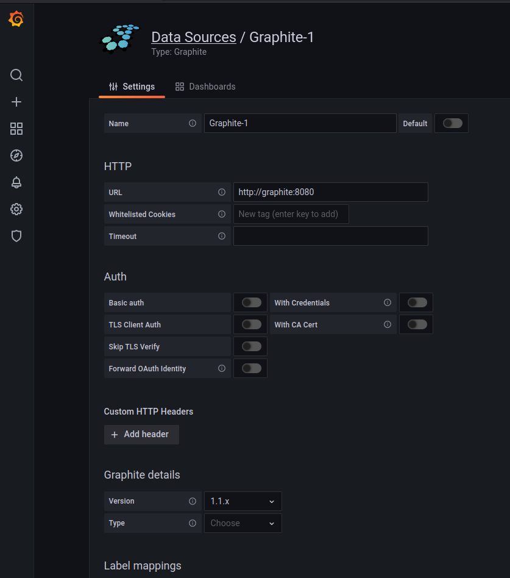
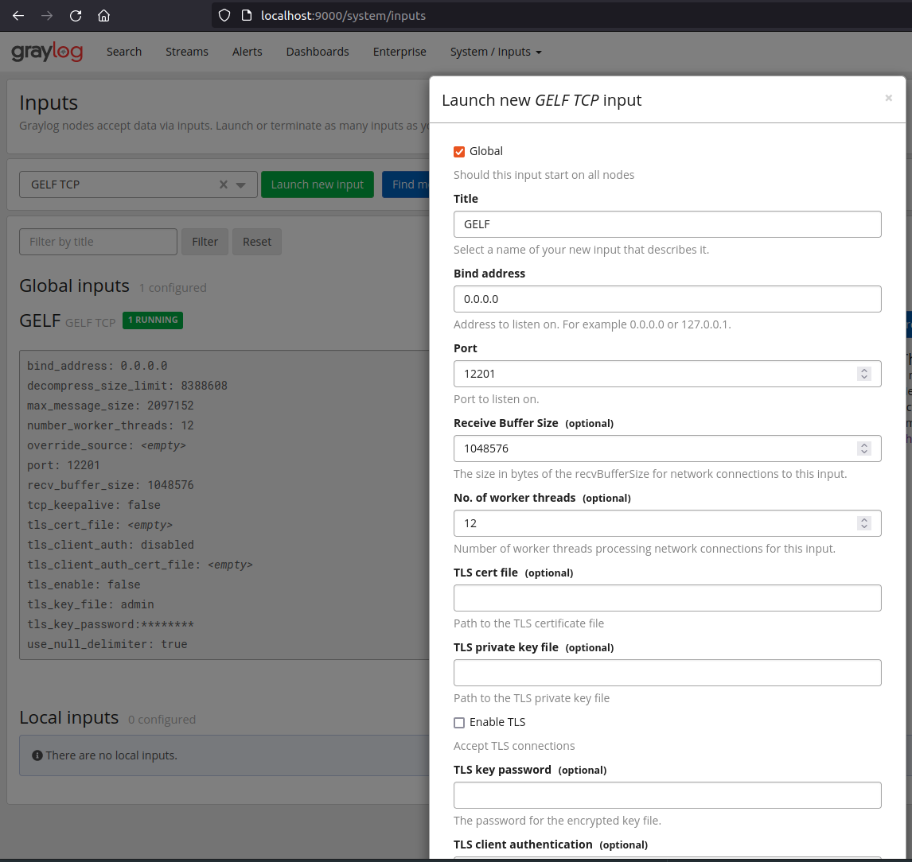

# metrics and logs to Grafana and Graylog
  - Publish metrics to carbon server and visualize on Grafana
  - Publish logs to graylog.

Before publishing the metrics and logs, we need to install graylog, graphite and grafana server on
the local machine.

# Running Graphite, Graylog and Grafana server using Docker

Use docker-compose and have it running in seconds.

        docker-compose up # in the root folder

To check if all the servers are running

* open the graphite front-end dashboard
  - http://localhost/dashboard
* Open the graylog UI
  - http://127.0.0.1:9000
* Open Grafana web interface
  - http://localhost:3000

# Installing the metrics publisher

`metrics_to_grafana`

Create virtual environment with Python 3.6 or later:

    git clone https://github.com/ebadkamil/metrics-to-grafana.git
    cd metrics-to-grafana
    python3 -m venev {env_name}

Activate virtual environment and install `metrics-to-grafana`:

    source {env_name}/bin/activate
    pip install .

Usage:

- Start consuming ESS flatbuffer messages from given topics

        start_load_publisher -g {grafana-carbon-address} -gl {graylog-logger-address} -l {log-level}
        grafana-carbon-address: for eg. "localhost"
        graylog-logger-address: for eg. "localhost:12201"
        log-level: for eg. debug, info, error, warn

# Configuring Graylog and Grafana.

Adding Graphite as a Data Source in Grafana |  Adding GELF TCP input in Graylog
:-------------------------:|:--------------------------------------------------:
  |  
